# 🏢 MANUAL OFICIAL

## IDENTIDADE VISUAL DO SITE


**"Tecnologia que conecta"**

Site: **Instalações Inteligentes**

---

### Desenvolvido por:

**Andre Garcia** | **Jose Paulo Archetti Conrado** | **Gustavo Carvalho**

Disciplina: **Design Digital - DSM / Projeto Integrador** | Professor: Érick

Curso: **DSM - Desenvolvimento de Software Multiplataforma** | Data: **18 de Novembro de 2025**

---

## 📋 Sumário Visual

1. [Introdução](#1-introdução)
2. [Sobre a Marca](#2-sobre-a-marca)
3. [Motivações](#3-motivações-e-propósito-do-site)
4. [Slogan](#4-slogan)
5. [Processo Criativo](#5-processo-criativo)
6. [Logotipo Final](#6-logotipo-final)
7. [Variações do Logo](#7-variações-do-logotipo)
8. [Paleta de Cores](#8-paleta-de-cores-oficial)
9. [Tipografia](#9-tipografia)
10. [Aplicações](#10-aplicações-da-marca)
11. [Proibições](#11-proibições-de-uso)
12. [Protótipo / Prints](#12-protótipo--prints-do-site-real-obrigatório)
13. [Créditos](#13-créditos-do-grupo)

---

## 1. Introdução

Este manual apresenta a identidade visual completa do site **Instalações Inteligentes**. Ele registra o conceito, o processo criativo e as diretrizes de uso da marca, garantindo consistência visual em todo o projeto Web. Este documento é o guia oficial para todos os desenvolvedores e designers envolvidos no projeto.

### Conceito da Marca

A identidade visual do **Instalações Inteligentes** foi desenvolvida para transmitir:

- **Modernidade**: Através de elementos visuais limpos e tecnológicos
- **Confiabilidade**: Cores sóbrias e profissionais (azul, cinza escuro)
- **Inovação**: Foco em tecnologias emergentes (IoT, automação)
- **Conectividade**: Representada no slogan e no conceito visual

**Observação:** Este material é criativo, visual e não segue padrões ABNT.

---

## 2. Sobre a Marca

### O que é o site e o que ele oferece?

O site **Instalações Inteligentes** é uma plataforma profissional focada em **soluções tecnológicas para instalações elétricas, redes de dados e Internet das Coisas (IoT)**. Oferecemos:

- **Instalações Elétricas**: Projetos seguros e eficientes para residências e empresas
- **Cabeamento Estruturado**: Organização e alto desempenho para redes de dados
- **Internet das Coisas (IoT)**: Automação e controle inteligente de ambientes
- **Galeria de Projetos**: Portfólio visual dos trabalhos realizados
- **Formulário de Contato**: Sistema integrado de solicitação de orçamentos via e-mail

### Público-alvo e Posicionamento

**Público-alvo principal:**

- Empresas que buscam infraestrutura tecnológica de qualidade
- Residências interessadas em automação e sistemas inteligentes
- Profissionais da área de TI e engenharia elétrica
- Faixa etária: 25-55 anos (decisores técnicos e empresariais)

**Posicionamento:**
Somos reconhecidos como uma **empresa especializada em convergência tecnológica**, unindo instalações elétricas tradicionais com soluções modernas de rede e IoT, oferecendo ambientes totalmente integrados e inteligentes.

### Problema que Resolvemos

Resolvemos o problema da **fragmentação de serviços tecnológicos**, onde clientes precisam contratar múltiplos fornecedores para elétrica, rede e automação. Oferecemos uma solução integrada, garantindo compatibilidade e eficiência em todos os sistemas instalados.

---

## 3. Motivações e Propósito do Site

### 💡 Benefício do Usuário

Permitir que o usuário **centralize todos os serviços de infraestrutura tecnológica em um único fornecedor**, economizando tempo, reduzindo custos e garantindo integração perfeita entre sistemas.

### 🎯 Dor Atendida

Aliviar a **complexidade de gerenciar múltiplos prestadores de serviço** para instalações tecnológicas, oferecendo uma solução completa desde o projeto até a implementação e suporte.

### ⚡ Diferencial Proposto

Nosso projeto propõe um diferencial de **integração total entre três áreas cruciais** (elétrica, rede e IoT), com uma **experiência digital moderna através de um site SPA (Single Page Application)** que oferece navegação fluida, formulário de contato com envio real de e-mails via API (Formspree) e design responsivo profissional.

## 4. Slogan

> **"Tecnologia que conecta"**

Um slogan curto, marcante e diretamente relacionado ao propósito da marca. Ele comunica:

- **Tecnologia**: Nossa expertise técnica
- **Conecta**: A integração entre sistemas e pessoas
- **Simplicidade**: Fácil de lembrar e pronunciar

**Análise do Slogan:**

- **Palavras-chave**: Tecnologia, Conexão
- **Tom**: Profissional, Moderno, Confiável
- **Aplicação**: Utilizado em todas as páginas do site, materiais de marketing e comunicações oficiais

---

## 5. Processo Criativo

O processo criativo foi uma jornada de experimentação, descarte e refinamento. O objetivo era casar o conceito de **inovação tecnológica** com a ideia de **confiabilidade e profissionalismo** de forma simples e memorável.

### Rascunhos e Experimentações

**Conceitos iniciais explorados:**

- Símbolos relacionados a circuitos elétricos
- Representações de redes e conexões
- Elementos abstratos representando automação
- Formas geométricas simples para transmitir modernidade

**Decisões tomadas:**

- Optou-se por um logotipo SVG escalável (1024x1024px)
- Preferência por design vetorial para garantir qualidade em qualquer tamanho
- Cores sóbrias (azul, cinza) alinhadas com o setor tecnológico

### Primeiras Versões do Logo

**Evolução do logotipo:**

1. **Versão Inicial**: Logo com elementos muito complexos (descartado)
2. **Versão Intermediária**: Simplificação das formas
3. **Versão Final**: Logo limpo, profissional, SVG vetorial

**Versões Anteriores:**

<table>
<tr>
<td align="center">
<br/>
<strong>V01 - Versão Inicial</strong><br/>
Favicon original - Formato ICO
</td>
<td align="center">
<br/>
<strong>V02 - Versão Horizontal</strong><br/>
Layout horizontal - Formato PNG
</td>
</tr>
</table>

**Arquivo final:** `img/logo/logo.svg` (1024x1024px)

### Justificativas da Escolha

**Forma:**

- Logo baseado em **formas geométricas limpas**
- Representa **modernidade e precisão técnica**
- Escalável para qualquer aplicação (favicon 32x32px até banner)

**Paleta:**

- **Azul (#007AFF)**: Confiança, tecnologia, profissionalismo
- **Cinza Escuro (#333333)**: Solidez, seriedade, contraste
- **Verde-azulado (#00C9A7)**: Inovação, energia, modernidade

**Importante:** O logo final é uma criação própria baseada em referências visuais do setor de tecnologia.

---

## 6. Logotipo Final

### 🎨 Logo Principal

**Arquivo:** `img/logo/logo.svg`  
**Dimensões:** 1024x1024px (formato SVG vetorial)  
**Formatos disponíveis:** SVG (principal), PNG para favicon


### O que o logo comunica e como representa o site

O nosso logotipo combina **elementos tecnológicos modernos** com **formas geométricas precisas** para simbolizar:

- **Integração**: Convergência de múltiplas áreas técnicas
- **Inovação**: Design contemporâneo e minimalista
- **Profissionalismo**: Cores sóbrias e composição equilibrada

### Especificações Técnicas

#### Versão Limpa (Sem Fundo)

- **Formato:** SVG (Scalable Vector Graphics)
- **Tamanho base:** 1024x1024px
- **Transparência:** Sim (fundo transparente)
- **Uso:** Website, materiais digitais

#### Grade de Construção

```
┌─────────────────────────┐
│ Margem: X               │
│  ┌───────────────────┐  │
│  │                   │  │
│  │   [LOGO CORE]     │  │
│  │                   │  │
│  └───────────────────┘  │
│ Margem: X               │
└─────────────────────────┘
```

**X = 10% da largura total do logo**

#### Margem de Segurança (X)

- **Espaço mínimo ao redor do logo:** 10% da largura do logo
- **Aplicação:** Nenhum elemento gráfico ou texto deve invadir essa área
- **Objetivo:** Garantir legibilidade e destaque visual

### Tamanhos Mínimos

| Aplicação       | Tamanho Mínimo |
| --------------- | -------------- |
| **Favicon**     | 32x32px        |
| **Logo Header** | 80px altura    |
| **Impressos**   | 3cm largura    |
| **Banner**      | 300px largura  |

---

## 7. Variações do Logotipo

### Versões Disponíveis

<table>
<tr>
<td align="center" width="33%">
<br/><br/>
<strong>🎨 Colorido (Principal)</strong><br/>
Arquivo: <code>logo.svg</code><br/>
Website, materiais digitais
</td>
<td align="center" width="33%">
<div style="background: #333333; padding: 30px; border-radius: 8px;">

</div><br/>
<strong>⚪ Negativo</strong><br/>
Fundo escuro #333333<br/>
Header, navbar, rodapé
</td>
<td align="center" width="33%">
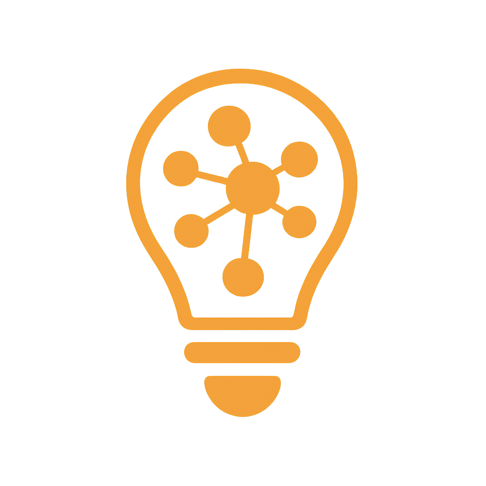<br/><br/>
<strong>📱 Ícone Reduzido</strong><br/>
Arquivo: <code>matriz-favicon.png</code><br/>
32x32px, 48x48px
</td>
</tr>
</table>

### Versões Alternativas

<table>
<tr>
<td align="center" width="50%">
<br/><br/>
<strong>Horizontal</strong><br/>
Arquivo: <code>logo-versao-02-horizontal.png</code><br/>
Uso: Versão alternativa horizontal
</td>
<td align="center" width="50%">
<br/><br/>
<strong>Vertical</strong><br/>
Arquivo: <code>logo.svg</code> | Até 300px largura<br/>
Uso: Hero section, páginas internas
</td>
</tr>
</table>

### Especificações Detalhadas

#### 🎨 Colorido (Principal)

**Arquivo:** `img/logo/logo.svg`

- **Uso:** Website (header), materiais digitais coloridos
- **Fundo:** Escuro (#333333) ou claro (#F8F9FA)

#### ⚫ Monocromático

**Conversão:** Escala de cinza do logo principal

- **Uso:** Impressões P&B, documentos oficiais
- **Cores:** Tons de cinza (#333 → #FFF)

#### ⚪ Negativo

**Inversão:** Logo em branco sobre fundo escuro

- **Uso:** Header do site (fundo escuro #333333)
- **Aplicação:** Navbar, rodapé

#### 📱 Ícone Reduzido (Favicon)

**Arquivo:** `img/logo/matriz-favicon.png`

- **Tamanho:** 32x32px, 48x48px
- **Formato:** PNG
- **Uso:** Favicon do navegador

### Código de Implementação

#### Horizontal (Versão Alternativa)

```html

```

#### Vertical (Hero Section)

```html

```

**Uso:** Hero section, páginas internas

- **Tamanho:** Até 300px largura
- **Centralizado:** text-align: center

---

## 8. Paleta de Cores Oficial

A paleta de cores foi definida para evocar **profissionalismo, tecnologia e modernidade**. As cores foram extraídas do arquivo `css/estilo.css` e refletem a identidade visual implementada.

> **📌 Nota para Desenvolvedores:**  
> O GitHub sanitiza HTML/CSS inline por questões de segurança. Para visualizar as cores corretamente neste manual:
>
> **Recomendação:** Crie imagens SVG ou PNG das amostras de cor e armazene em `img/colors/`. Exemplo:
>
> ```markdown
>  **#007AFF**
> ```
>
> Isso funciona perfeitamente no GitHub e mantém a documentação visual.

### Cores Primárias

| Cor                  | Amostra                                    | HEX       | RGB              |
| -------------------- | ------------------------------------------ | --------- | ---------------- |
| **Azul Tecnológico** |  | `#007AFF` | RGB(0, 122, 255) |
| **Cinza Escuro**     |      | `#333333` | RGB(51, 51, 51)  |

**Aplicação:**

- `#007AFF` - Botões primários, títulos (H1-H5), links ativos, CTA
- `#333333` - Header, footer, textos principais, fundos escuros

### Cores Secundárias

| Cor               | Amostra                                 | HEX       | RGB              |
| ----------------- | --------------------------------------- | --------- | ---------------- |
| **Verde-Azulado** |  | `#00C9A7` | RGB(0, 201, 167) |
| **Cinza Médio**   |    | `#555555` | RGB(85, 85, 85)  |

**Aplicação:**

- `#00C9A7` - Botões de sucesso (btn-success), destaques secundários
- `#555555` - Textos secundários (p.lead), legendas

### Cores Neutras

| Cor                     | Amostra                               | HEX       | RGB                |
| ----------------------- | ------------------------------------- | --------- | ------------------ |
| **Branco**              | 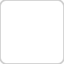      | `#FFFFFF` | RGB(255, 255, 255) |
| **Cinza Claro (Fundo)** | 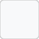 | `#F8F9FA` | RGB(248, 249, 250) |
| **Cinza Borda**         |  | `#CCCCCC` | RGB(204, 204, 204) |

**Aplicação:**

- `#FFFFFF` - Fundos de seções, cards, modais
- `#F8F9FA` - Background do body, seções alternadas
- `#CCCCCC` - Bordas de inputs, divisores

### Tabela de Cores com Aplicações

| Cor                  | Amostra                           | HEX       | Uso Principal                    | Onde Encontrar                 |
| -------------------- | --------------------------------- | --------- | -------------------------------- | ------------------------------ |
| **Azul Tecnológico** |  | `#007AFF` | Títulos, botões primários, links | `.btn-primary`, `h1-h5`        |
| **Cinza Escuro**     |  | `#333333` | Header, footer, textos           | `.site-header`, `.site-footer` |
| **Verde-Azulado**    |  | `#00C9A7` | Botões de sucesso, CTAs          | `.btn-success`                 |
| **Cinza Médio**      |  | `#555555` | Textos secundários               | `p.lead`                       |
| **Branco**           |  | `#FFFFFF` | Fundos, contraste                | `body`, `section`              |
| **Cinza Claro**      |  | `#F8F9FA` | Background geral                 | `body background-color`        |
| **Cinza Borda**      |  | `#CCCCCC` | Bordas de campos                 | `input border`                 |

### Contraste e Acessibilidade

**Combinações validadas (WCAG 2.1 AA):**

- ✅ Azul #007AFF sobre Branco #FFFFFF (contraste 4.5:1)
- ✅ Cinza Escuro #333333 sobre Branco #FFFFFF (contraste 12.6:1)
- ✅ Branco #FFFFFF sobre Cinza Escuro #333333 (contraste 12.6:1)

---

## 9. Tipografia

Utilizamos o **máximo de 2 famílias tipográficas** para garantir a leveza e a consistência da marca. A fonte principal é robusta para títulos, enquanto a fonte de corpo é altamente legível.

### Fonte de Títulos (H1, H2, H3, H4, H5)

**Nome da Fonte:** `Montserrat` (Bold / ExtraBold)

```css
h1,
h2,
h3,
h4,
h5 {
  font-family: 'Montserrat', sans-serif;
  font-weight: 700;
  color: #007aff;
}
```

**Exemplo:**

# Headline Principal

## Subtítulo Importante

**Justificativa:** Escolhida por sua **força e modernidade**, garantindo impacto visual nos títulos principais. Montserrat é uma fonte geométrica sans-serif que transmite profissionalismo.

**Onde usar:**

- Títulos de seções (H1, H2)
- Navegação (navbar)
- CTAs importantes
- Logos textuais

**Tamanhos recomendados:**

- H1: `2rem` (32px) - Mobile / `display-5` (3rem) - Desktop
- H2: `1.75rem` (28px)
- H3-H5: `1.5rem - 1.25rem` (24-20px)

### Fonte dos Textos (Corpo)

**Nome da Fonte:** `Poppins` (Regular)

```css
body {
  font-family: 'Poppins', sans-serif;
  line-height: 1.6;
  color: #333333;
}
```

**Exemplo de texto:**
Este é o corpo principal de texto. Tamanho sugerido: 16px. O espaçamento entre linhas (line-height) deve ser de 150% (1.5) para maximizar a legibilidade em dispositivos móveis e desktop.

**Justificativa:** Poppins é uma fonte humanista sans-serif com **excelente legibilidade** em telas. Suas curvas suaves facilitam a leitura prolongada.

**Onde usar:**

- Parágrafos de texto
- Listas
- Formulários (inputs, textareas)
- Descrições de serviços

**Tamanhos recomendados:**

- Corpo: `1rem` (16px)
- Lead: `1.2rem` (19.2px) - `.lead`
- Small: `0.9rem` (14.4px) - `.small`

### Fonte Destaques / Botões

**Call to Action (CTA) em Maiúsculas**

```css
.btn {
  font-family: 'Montserrat', sans-serif;
  font-weight: 600;
  text-transform: uppercase;
  letter-spacing: 0.05em;
}
```

**Exemplo:**

```html
<button class="btn btn-primary">SOLICITE UM ORÇAMENTO</button>
```

### Hierarquia Tipográfica

```
┌─────────────────────────────────────┐
│ H1 - Montserrat Bold (2-3rem)      │
│ ↓ Títulos principais                │
├─────────────────────────────────────┤
│ H2 - Montserrat Bold (1.75rem)     │
│ ↓ Subtítulos de seção               │
├─────────────────────────────────────┤
│ H3-H5 - Montserrat Bold (1.25-1.5) │
│ ↓ Títulos internos                  │
├─────────────────────────────────────┤
│ Body - Poppins Regular (1rem)      │
│ ↓ Texto corrido                     │
├─────────────────────────────────────┤
│ Lead - Poppins Regular (1.2rem)    │
│ ↓ Destaques de parágrafo            │
└─────────────────────────────────────┘
```

### Código de Importação (Google Fonts)

```html
<link
  href="https://fonts.googleapis.com/css2?family=Montserrat:wght@400;600;700&family=Poppins:wght@300;400;500&display=swap"
  rel="stylesheet"
/>
```

---

## 10. Aplicações da Marca

Exemplos visuais de como a identidade visual deve ser aplicada nos principais pontos de contato do usuário com o site.

### Aplicação no Cabeçalho (Header)

**Logo utilizado no header:**


**Reprodução visual do Header do projeto:**

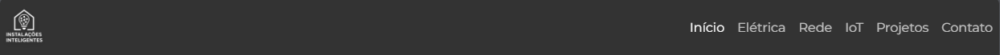

**Especificações do Header:**

```html
<nav class="navbar navbar-expand-lg navbar-dark site-header">
  <div class="container-fluid">
    <a class="navbar-brand" href="index.html">
      
    </a>
    <div class="collapse navbar-collapse" id="navbarNav">
      <ul class="navbar-nav ms-auto">
        <li class="nav-item">
          <a class="nav-link" href="index.html">Início</a>
        </li>
        <li class="nav-item">
          <a class="nav-link" href="eletrica.html">Elétrica</a>
        </li>
        <li class="nav-item">
          <a class="nav-link" href="rede.html">Rede</a>
        </li>
        <li class="nav-item">
          <a class="nav-link" href="iot.html">IoT</a>
        </li>
        <li class="nav-item">
          <a class="nav-link" href="projetos.html">Projetos</a>
        </li>
        <li class="nav-item">
          <a class="nav-link" href="contato.html">Contato</a>
        </li>
      </ul>
    </div>
  </div>
</nav>
```

**Especificações do Header:**

```html
<nav class="navbar navbar-expand-lg navbar-dark site-header">
  <div class="container-fluid">
    <a class="navbar-brand" href="index.html">
      
    </a>
    <!-- Menu de navegação -->
  </div>
</nav>
```

**Características:**

- Fundo: `#333333` (cinza escuro)
- Logo: 80px altura
- Links: Cor branca com hover
- Posição: Fixa no topo (fixed)
- Sombra: `box-shadow: 0 2px 4px rgba(0,0,0,0.1)`

### Logo na Hero Section (Página Inicial)


**Aplicação na Hero Section:**

A hero section utiliza o logo principal em tamanho maior (até 300px de largura) para criar impacto visual imediato. O logo é centralizado e acompanhado do slogan **"Tecnologia que conecta"** logo abaixo.

**Código de implementação:**

```html
<section class="bg-light text-center py-5">
  <div class="container">
    
    <h1 class="display-5 fw-bold">Tecnologia que conecta</h1>
    <p class="lead">
      Soluções em instalações elétricas, redes e IoT para ambientes
      inteligentes.
    </p>
    <a href="contato.html#contact-form" class="btn btn-primary btn-lg">
      Solicite um orçamento
    </a>
  </div>
</section>
```

### Exemplo de Botões (Primário/Secundário)


**Tipos de Botões:**

```html
<!-- Botão Primário -->
<button class="btn btn-primary">Solicite um orçamento</button>

<!-- Botão Secundário -->
<button class="btn btn-success">Ver Projetos</button>

<!-- Botão Neutro -->
<button class="btn btn-outline-secondary">Saiba mais</button>
```

**Estilos:**

- **Primário**: Fundo `#007AFF`, texto branco, hover com opacidade 90%
- **Secundário**: Fundo `#00C9A7`, texto branco
- **Neutro**: Borda cinza, fundo transparente

**Exemplo de Card de Serviço:**
O mockup acima também demonstra como os cards de serviços são estruturados, combinando:

- Imagem com `border-radius: 8px`
- Título em Montserrat Bold (`#007AFF`)
- Descrição em Poppins Regular (`#555555`)
- Botão CTA primário

### Uso em Dispositivos (Mobile Mockup)

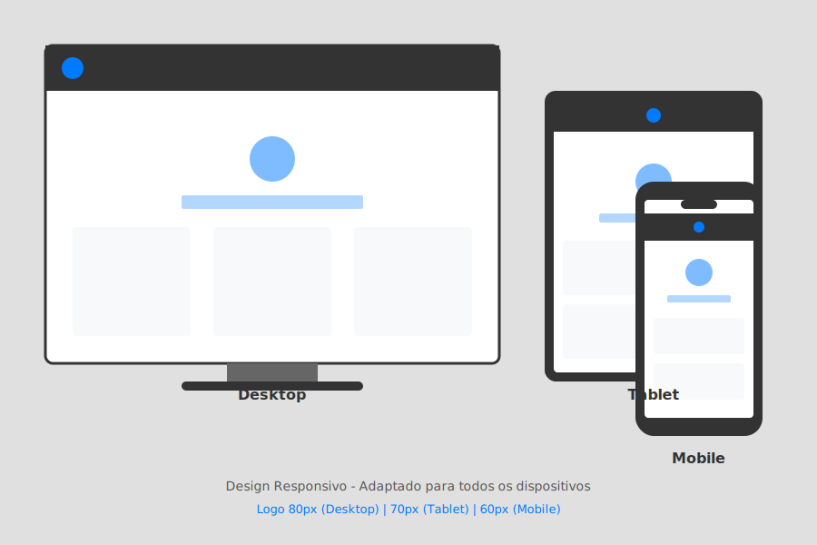

**Responsividade:**

- **Desktop (>768px)**: Logo 80px, menu horizontal
- **Tablet (768px)**: Logo 70px, menu colapsável
- **Mobile (<576px)**: Logo 60px, hamburger menu

**Breakpoints:**

```css
/* Mobile First */
@media (max-width: 768px) {
  .navbar-brand img {
    height: 60px;
  }
  h1 {
    font-size: 2rem;
  }
  .btn {
    width: 100%;
  }
}
```

### Hero Section (Página Inicial)

```html
<section class="bg-light text-center py-5">
  <div class="container">
    
    <h1 class="display-5 fw-bold">Tecnologia que conecta</h1>
    <p class="lead">
      Soluções em instalações elétricas, redes e IoT para ambientes
      inteligentes.
    </p>
    <a href="contato.html#contact-form" class="btn btn-primary btn-lg">
      Solicite um orçamento
    </a>
  </div>
</section>
```

### Cards de Serviços

```html
<div class="col-md-4">
  
  <h4>Instalações Elétricas</h4>
  <p>Projetos seguros e eficientes para residências e empresas.</p>
</div>
```

**Características:**

- Imagens: `border-radius: 8px`
- Títulos: Montserrat, cor `#007AFF`
- Espaçamento: `mb-3` (margin-bottom: 1rem)

---

## 11. Proibições de Uso

Para manter a integridade visual da marca, as seguintes práticas são **estritamente proibidas**.

### Exemplos Visuais de Proibições

<table>
<tr>
<td align="center">
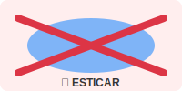<br/>
<strong>❌ Esticar o Logo</strong><br/>
Não alterar proporções do logo
</td>
<td align="center">
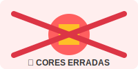<br/>
<strong>❌ Mudar as Cores</strong><br/>
Usar apenas paleta oficial
</td>
<td align="center">
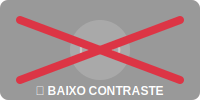<br/>
<strong>❌ Baixo Contraste</strong><br/>
Garantir contraste mínimo 4.5:1
</td>
</tr>
<tr>
<td align="center">
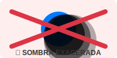<br/>
<strong>❌ Sombra Exagerada</strong><br/>
Usar apenas sombra sutil
</td>
<td align="center">
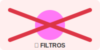<br/>
<strong>❌ Aplicar Filtros</strong><br/>
Sem blur, hue-rotate, sepia
</td>
<td align="center">
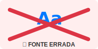<br/>
<strong>❌ Alterar Tipografia</strong><br/>
Somente Montserrat e Poppins
</td>
</tr>
</table>

### ❌ Esticar o Logo

**Proibido:** Alterar proporções do logo (aspect ratio)

```
[X] Logo esticado horizontalmente
[X] Logo comprimido verticalmente
```

**Correto:** Sempre manter proporção original (1:1)

### ❌ Mudar as Cores Originais

**Proibido:** Alterar paleta de cores definida

```
[X] Logo em vermelho, amarelo ou cores não autorizadas
[X] Gradientes não previstos
```

**Correto:** Usar apenas as cores da paleta oficial

### ❌ Fundo que Prejudique a Leitura

**Proibido:** Aplicar logo sobre fundos com baixo contraste

```
[X] Logo azul sobre fundo azul claro
[X] Logo cinza sobre fundo cinza
```

**Correto:** Garantir contraste mínimo de 4.5:1 (WCAG AA)

### ❌ Usar Sombra Exagerada

**Proibido:** Aplicar efeitos de sombra não autorizados

```css
/* ❌ PROIBIDO */
.logo {
  box-shadow: 0 10px 50px rgba(0, 0, 0, 0.8);
  filter: drop-shadow(5px 5px 10px red);
}
```

**Correto:** Usar apenas a sombra sutil do header (`0 2px 4px rgba(0,0,0,0.1)`)

### ❌ Aplicar Filtros Aleatórios

**Proibido:**

```css
/* ❌ PROIBIDO */
filter: blur(2px);
filter: hue-rotate(180deg);
filter: sepia(100%);
```

### ❌ Alterar a Tipografia Definida

**Proibido:** Usar fontes diferentes de Montserrat e Poppins

```css
/* ❌ PROIBIDO */
h1 {
  font-family: 'Comic Sans MS';
}
body {
  font-family: 'Times New Roman';
}
```

### ❌ Distorcer Elementos da Identidade

**Proibido:**

- Rotacionar o logo em ângulos não retos
- Adicionar textos sobre o logo
- Misturar elementos do logo com outros grafismos
- Remover partes do logo

### ✅ Resumo de Boas Práticas

| Elemento       | Permitido                       | Proibido                    |
| -------------- | ------------------------------- | --------------------------- |
| **Logo**       | Redimensionar proporcionalmente | Esticar, comprimir          |
| **Cores**      | Usar paleta oficial             | Criar novas cores           |
| **Tipografia** | Montserrat + Poppins            | Outras fontes               |
| **Fundos**     | Alto contraste                  | Baixo contraste             |
| **Efeitos**    | Sombra sutil (header)           | Sombras exageradas, filtros |

---

## 12. Protótipo / Prints do Site Real (Obrigatório)

Demonstração da coerência entre o design proposto no manual e a interface construída. Este é o teste final de consistência.

> **💻 Site Publicado:**  
> **GitHub Pages:** [https://andregarcia81.github.io/prj-pi/](https://andregarcia81.github.io/prj-pi/)  
> **Repositório:** [https://github.com/andregarcia81/prj-pi](https://github.com/andregarcia81/prj-pi)

### Página Inicial (Desktop)

**Mockup baseado no primeiro commit do projeto:**

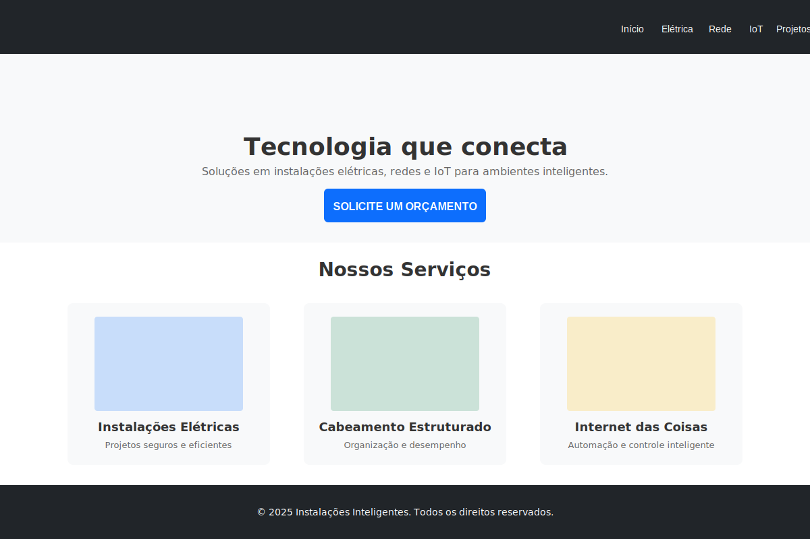

**URL:** `index.html`

**Elementos aplicados:**

- ✅ Logo no header (`logo-versao-02-horizontal.png`, 80px altura)
- ✅ Navegação com menu horizontal
- ✅ Hero section com logo centralizado (450px largura)
- ✅ Slogan "Tecnologia que conecta" em Montserrat Bold
- ✅ Botão CTA primário (azul Bootstrap `#0D6EFD`)
- ✅ Cards de serviços com imagens e descrições
- ✅ Rodapé com fundo escuro (`#212529`)

**Código da página inicial (primeiro commit):**

```html
<main id="spa-content" class="spa-fade-in">
  <!-- Hero Section -->
  <section class="bg-light text-center py-5">
    <div class="container">
      
      <h1 class="display-5 fw-bold">Tecnologia que conecta</h1>
      <p class="lead">
        Soluções em instalações elétricas, redes e IoT para ambientes
        inteligentes.
      </p>
      <a href="contato.html" class="btn btn-primary btn-lg">
        Solicite um orçamento
      </a>
    </div>
  </section>

  <!-- Serviços -->
  <section class="py-5 bg-white">
    <div class="container">
      <h2 class="text-center mb-4">Nossos Serviços</h2>
      <div class="row text-center">
        <div class="col-md-4">
          
          <h4>Instalações Elétricas</h4>
          <p>Projetos seguros e eficientes</p>
        </div>
        <!-- Outros serviços -->
      </div>
    </div>
  </section>
</main>
```

### Versão Mobile e Páginas Internas

**Mockup Mobile baseado no primeiro commit:**

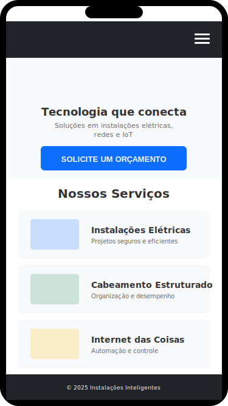

**Páginas implementadas:**

- ✅ `index.html` - Página inicial
- ✅ `eletrica.html` - Instalações Elétricas
- ✅ `rede.html` - Cabeamento Estruturado
- ✅ `iot.html` - Internet das Coisas
- ✅ `projetos.html` - Galeria de Projetos
- ✅ `contato.html` - Formulário de Contato (Formspree)
- ✅ `agradecimento.html` - Confirmação de envio

**Responsividade:**

```css
/* Mobile (<768px) */
.navbar-brand img {
  height: 60px;
}
h1 {
  font-size: 2rem;
}
.btn {
  width: 100%;
}

/* Tablet (768px-1024px) */
.navbar-brand img {
  height: 70px;
}

/* Desktop (>1024px) */
.navbar-brand img {
  height: 80px;
}
```

### Elementos de UI (Cards, Menus e Botões Aplicados)

#### Navbar (Header)

```html
<nav class="navbar navbar-expand-lg navbar-dark site-header">
  <div class="container-fluid">
    <a class="navbar-brand" href="index.html">
      
    </a>
    <ul class="navbar-nav ms-auto">
      <li class="nav-item">
        <a class="nav-link" href="index.html">Início</a>
      </li>
      <li class="nav-item">
        <a class="nav-link" href="contato.html">Contato</a>
      </li>
    </ul>
  </div>
</nav>
```

#### Footer (Rodapé)

```html
<footer class="site-footer">
  <div class="container-fluid">
    <p class="mb-0">
      © 2025 Instalações Inteligentes. Todos os direitos reservados.
    </p>
  </div>
</footer>
```

#### Formulário de Contato

```html
<form id="contact-form" method="POST" action="https://formspree.io/f/xdkyergz">
  <input type="text" name="nome" placeholder="Nome" required />
  <input type="email" name="email" placeholder="E-mail" required />
  <textarea name="mensagem" placeholder="Mensagem" required></textarea>
  <button type="submit" class="btn btn-primary">Enviar</button>
  <div id="form-feedback"></div>
</form>
```

#### Feedback Visual (Toaster)

O sistema de feedback visual utiliza toasters flutuantes modernos para informar o status do envio do formulário. O design segue princípios de Material Design 3 com glassmorphism, ícones visuais e animações suaves.

**Características Visuais:**

- 🎯 **Posicionamento**: Fixed no canto superior direito (top: 24px, right: 24px)
- 📐 **Dimensões**: Min-width 320px, max-width 420px
- 🎨 **Estilo**: Glassmorphism com backdrop-filter blur(10px)
- ✨ **Bordas**: Border-radius 12px para aparência moderna
- 🎭 **Ícones**: Emoji antes do texto (⚠️, ✅, ⏳)
- 💫 **Animação**: Slide horizontal com bounce effect (cubic-bezier spring)
- 🌑 **Sombra**: Dupla camada - 0 8px 32px rgba(0,0,0,0.12) + 0 2px 8px rgba(0,0,0,0.08)
- ⏱️ **Auto-hide**: Desaparece após 5 segundos (exceto "Enviando...")
- 📱 **Responsivo**: Em mobile, ocupa largura total e desce do topo

**Estados do Toaster:**

| Estado        | Ícone | Cor Principal | Gradiente Background                                                      | Borda                               | Mensagem                                            |
| ------------- | ----- | ------------- | ------------------------------------------------------------------------- | ----------------------------------- | --------------------------------------------------- |
| **Validação** | ⚠️    | `#c92a2a`     | `linear-gradient(135deg, rgba(254,238,238,0.95), rgba(254,226,226,0.95))` | `1.5px solid rgba(220,53,69,0.3)`   | "Por favor, preencha todos os campos obrigatórios." |
| **Enviando**  | ⏳    | `#495057`     | `linear-gradient(135deg, rgba(248,249,250,0.95), rgba(233,236,239,0.95))` | `1.5px solid rgba(108,117,125,0.2)` | "Enviando..."                                       |
| **Sucesso**   | ✅    | `#2b8a3e`     | `linear-gradient(135deg, rgba(212,237,218,0.95), rgba(195,230,203,0.95))` | `1.5px solid rgba(40,167,69,0.3)`   | "Mensagem enviada com sucesso! Redirecionando..."   |
| **Erro**      | ⚠️    | `#c92a2a`     | `linear-gradient(135deg, rgba(254,238,238,0.95), rgba(254,226,226,0.95))` | `1.5px solid rgba(220,53,69,0.3)`   | "Erro ao enviar. Tente novamente."                  |

**Implementação JavaScript:**

```javascript
// Função centralizada para exibir toaster
function showToaster(message, type, autoHide = true) {
  if (feedbackEl) {
    feedbackEl.textContent = message;
    feedbackEl.className = `${type} show`;

    // Auto-hide após 5 segundos (exceto para "enviando")
    if (autoHide && type !== 'text-muted') {
      setTimeout(() => {
        feedbackEl.classList.remove('show');
      }, 5000);
    }
  }
}

// Uso nos diferentes estados:
// Validação
showToaster('Por favor, preencha todos os campos obrigatórios.', 'text-danger');

// Enviando
showToaster('Enviando...', 'text-muted', false);

// Sucesso
showToaster(
  'Mensagem enviada com sucesso! Redirecionando...',
  'text-success',
  false
);

// Erro
showToaster(
  'Erro de conexão. Verifique sua internet e tente novamente.',
  'text-danger'
);
```

**Implementação CSS:**

```css
/* Toaster flutuante moderno */
#form-feedback {
  position: fixed;
  top: 24px;
  right: 24px;
  z-index: 9999;
  padding: 18px 24px;
  border-radius: 12px;
  font-size: 0.95rem;
  font-weight: 500;
  text-align: left;
  min-width: 320px;
  max-width: 420px;
  backdrop-filter: blur(10px);
  box-shadow: 0 8px 32px rgba(0, 0, 0, 0.12), 0 2px 8px rgba(0, 0, 0, 0.08);
  opacity: 0;
  transform: translateX(450px) scale(0.9);
  transition: all 0.45s cubic-bezier(0.34, 1.56, 0.64, 1);
  pointer-events: none;
  display: flex;
  align-items: center;
  gap: 12px;
}

/* Ícones via pseudo-elemento */
#form-feedback::before {
  content: '';
  font-size: 1.25rem;
  flex-shrink: 0;
  line-height: 1;
}

#form-feedback.show {
  opacity: 1;
  transform: translateX(0) scale(1);
  pointer-events: auto;
}

/* Estado: Erro/Validação */
#form-feedback.text-danger {
  background: linear-gradient(
    135deg,
    rgba(254, 238, 238, 0.95),
    rgba(254, 226, 226, 0.95)
  );
  color: #c92a2a;
  border: 1.5px solid rgba(220, 53, 69, 0.3);
}
#form-feedback.text-danger::before {
  content: '⚠️';
}

/* Estado: Sucesso */
#form-feedback.text-success {
  background: linear-gradient(
    135deg,
    rgba(212, 237, 218, 0.95),
    rgba(195, 230, 203, 0.95)
  );
  color: #2b8a3e;
  border: 1.5px solid rgba(40, 167, 69, 0.3);
}
#form-feedback.text-success::before {
  content: '✅';
}

/* Estado: Enviando */
#form-feedback.text-muted {
  background: linear-gradient(
    135deg,
    rgba(248, 249, 250, 0.95),
    rgba(233, 236, 239, 0.95)
  );
  color: #495057;
  border: 1.5px solid rgba(108, 117, 125, 0.2);
}
#form-feedback.text-muted::before {
  content: '⏳';
}

/* Animação com bounce effect */
@keyframes toasterSlideIn {
  0% {
    opacity: 0;
    transform: translateX(450px) scale(0.9);
  }
  60% {
    opacity: 1;
    transform: translateX(-8px) scale(1.02);
  }
  100% {
    opacity: 1;
    transform: translateX(0) scale(1);
  }
}

/* Responsividade mobile */
@media (max-width: 576px) {
  #form-feedback {
    top: 16px;
    right: 16px;
    left: 16px;
    min-width: auto;
    max-width: none;
    transform: translateY(-120px) scale(0.9);
  }

  #form-feedback.show {
    transform: translateY(0) scale(1);
  }
}
```

**Princípios de Design Aplicados:**

- ✅ **Glassmorphism**: Efeito de vidro fosco com backdrop-filter para modernidade
- ✅ **Micro-interações**: Animação bounce com overshoot para feedback tátil
- ✅ **Hierarquia Visual**: Ícones grandes + texto alinhado à esquerda
- ✅ **Gradientes Sutis**: Linear gradients para profundidade sem peso visual
- ✅ **Sombras em Camadas**: Material Design 3 com dupla elevação
- ✅ **Cores Semânticas**: Verde (sucesso), Vermelho (erro/validação), Cinza (loading)
- ✅ **Timing Inteligente**: Auto-hide após 5s, exceto estados transitórios
- ✅ **Acessibilidade**: Alto contraste, mensagens claras em português, ícones universais
- ✅ **Responsividade**: Adaptação para mobile com animação do topo
- ✅ **Performance**: CSS transforms (GPU-accelerated), sem reflows### Tecnologias e Arquitetura

**Stack Técnico:**

- HTML5 + CSS3
- JavaScript ES6+ (SPA)
- Bootstrap 5.3.2
- Google Fonts (Montserrat, Poppins)
- Formspree API (envio de e-mails)

**Arquitetura SPA:**

- `js/spa.js` - Roteamento client-side
- `js/script.js` - Formulário e animações
- `css/estilo.css` - Estilos customizados

**Características técnicas:**

- Navegação sem reload (fetch + History API)
- Transições suaves (fade-in/fade-out)
- Formulário com envio assíncrono
- Rodapé dinâmico fixo
- Scroll animations (Intersection Observer)

---

## 13. Créditos do Grupo

### 👨‍💻 Equipe de Desenvolvimento

<table>
<tr>
<td align="center" width="33%">
<h3>1️⃣ Andre Garcia</h3>
<p><strong>Função:</strong> Desenvolvedor Full Stack / Designer de Interface</p>
<p><strong>Responsabilidades:</strong></p>
<ul align="left">
<li>Arquitetura SPA (Single Page Application)</li>
<li>Integração Formspree (envio de e-mails)</li>
<li>Design responsivo e UX</li>
<li>Gestão de repositório Git</li>
</ul>
<p>📧 <a href="mailto:andre.garcia17@fatec.sp.gov.br">andre.garcia17@fatec.sp.gov.br</a></p>
<p>🔗 <a href="https://github.com/andregarcia81">@andregarcia81</a></p>
</td>
<td align="center" width="33%">
<h3>2️⃣ Jose Paulo Archetti Conrado</h3>
<p><strong>Função:</strong> Desenvolvedor Front-end / Documentação</p>
<p><strong>Responsabilidades:</strong></p>
<ul align="left">
<li>Implementação de componentes</li>
<li>Otimização de performance</li>
<li>Testes e validação</li>
<li>Documentação técnica (README.md)</li>
</ul>
<p>📧 <a href="mailto:ppconrado@yahoo.com.br">ppconrado@yahoo.com.br</a></p>
<p>🔗 <a href="https://github.com/ppconrado">@ppconrado</a></p>
</td>
<td align="center" width="33%">
<h3>3️⃣ Gustavo Carvalho</h3>
<p><strong>Função:</strong> Desenvolvedor / Designer Visual</p>
<p><strong>Responsabilidades:</strong></p>
<ul align="left">
<li>Identidade visual da marca</li>
<li>Manual de identidade visual</li>
<li>Design de interfaces</li>
<li>Padronização visual</li>
</ul>
<p>📧 <a href="mailto:gustavo.alves52@fatec.sp.gov.br">gustavo.alves52@fatec.sp.gov.br</a></p>
</td>
</tr>
</table>

### 📚 Instituição de Ensino

**FATEC - Faculdade de Tecnologia**  
Curso: **DSM - Desenvolvimento de Software Multiplataforma**  
Disciplina: **Design Digital / Projeto Integrador**  
Professor: **Érick**  
Data: **18 de Novembro de 2025**

---

<div align="center">

**Manual Oficial de Identidade Visual | Instalações Inteligentes © 2025**

_Este documento foi elaborado seguindo a estrutura oficial de 13 itens do manual de referência._

**"Tecnologia que conecta"**

</div>

### 🙏 Agradecimentos

- **FATEC** - Instituição de ensino e apoio acadêmico
- **Professores da FATEC** - Orientação e suporte técnico
- **Bootstrap Team** - Framework CSS utilizado
- **Formspree** - Serviço de formulários gratuito
- **Google Fonts** - Fontes Montserrat e Poppins
- **MDN Web Docs** - Documentação de referência

### 📊 Estatísticas do Projeto

| Métrica                      | Valor                                                                     |
| ---------------------------- | ------------------------------------------------------------------------- |
| **Commits Git**              | 34                                                                        |
| **Páginas HTML**             | 7                                                                         |
| **Linhas de CSS**            | ~300                                                                      |
| **Linhas de JS**             | ~400                                                                      |
| **Tempo de desenvolvimento** | 3 meses                                                                   |
| **Tecnologias**              | 8 (HTML5, CSS3, JS ES6+, Bootstrap, Formspree, Git, VS Code, Live Server) |

### 🔗 Links do Projeto

- **Repositório GitHub:** [https://github.com/andregarcia81/prj-pi](https://github.com/andregarcia81/prj-pi)
- **Documentação técnica:** `README.md` (raiz do projeto)
- **Manual de Identidade Visual:** `MANUAL_IDENTIDADE_VISUAL.md` (este arquivo)

---

## 📄 Informações Adicionais

### Histórico de Versões

| Versão | Data       | Autor                       | Alterações                                           |
| ------ | ---------- | --------------------------- | ---------------------------------------------------- |
| 1.0    | 18/11/2025 | Andre Garcia                | Criação do manual com estrutura completa de 13 itens |
| 1.0    | 18/11/2025 | Jose Paulo Archetti Conrado | Revisão e validação do conteúdo                      |
| 1.0    | 18/11/2025 | Gustavo Carvalho            | Elaboração da identidade visual e design             |

### Status de Implementação

| Item            | Status          | Observações                           |
| --------------- | --------------- | ------------------------------------- |
| Logo SVG        | ✅ Implementado | `img/logo/logo.svg` (1024x1024px)     |
| Paleta de cores | ✅ Implementado | Extraída de `css/estilo.css`          |
| Tipografia      | ✅ Implementado | Montserrat + Poppins via Google Fonts |
| Responsividade  | ✅ Implementado | Mobile-first, breakpoints Bootstrap   |
| SPA             | ✅ Implementado | `js/spa.js` com navegação fluida      |
| Formulário      | ✅ Implementado | Formspree API integrado               |

### Contato para Dúvidas

Para esclarecimentos sobre este manual de identidade visual, entre em contato com a equipe de desenvolvimento:

- **E-mail:** andre.garcia17@factec.sp.gov.br, ppconrado@yahoo.com.br ou gustavo.alves52@fatec.sp.gov.br
- **GitHub Issues:** [https://github.com/andregarcia81/prj-pi/issues](https://github.com/andregarcia81/prj-pi/issues)

---

<div align="center">

**Manual Oficial de Identidade Visual | Instalações Inteligentes © 2025**

_Este documento foi elaborado seguindo a estrutura oficial de 13 itens do manual de referência._

**"Tecnologia que conecta"**

</div>
