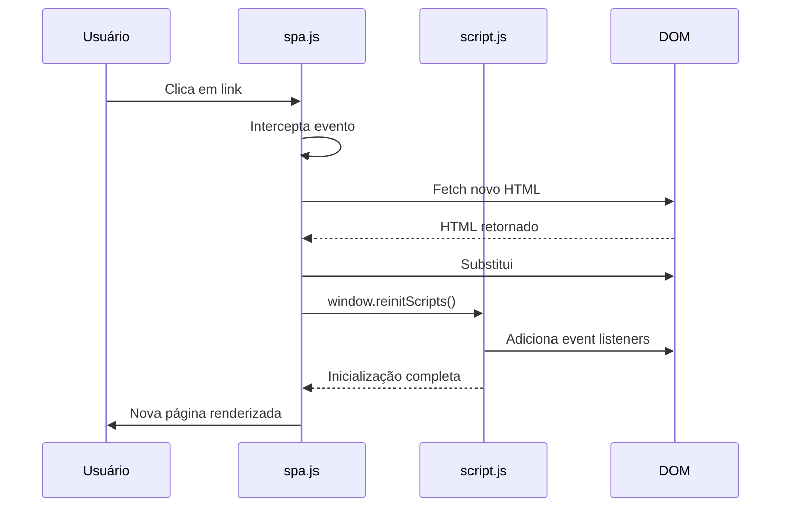
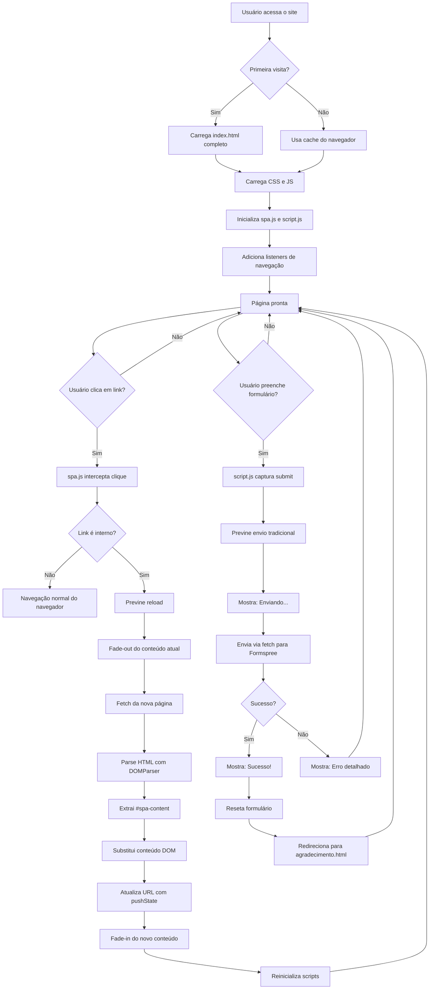
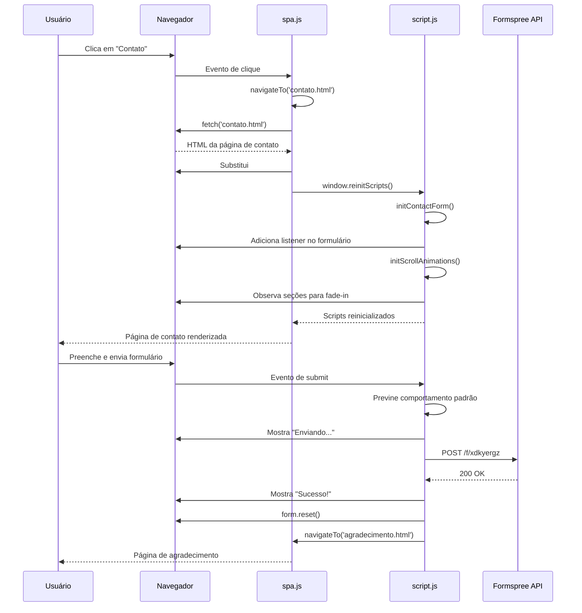

# 🏢 Instalações Inteligentes - Single Page Application (SPA)

> Projeto acadêmico desenvolvido para a FATEC, apresentando uma aplicação web moderna com navegação SPA, formulário de contato integrado e animações fluidas.

[](https://github.com/andregarcia81/prj-pi)
[](LICENSE)

---

## 📋 Índice

1. [Evolução do Projeto](#-evolução-do-projeto)
2. [O que é uma Single Page Application (SPA)?](#-o-que-é-uma-single-page-application-spa)
3. [Arquitetura do Roteamento](#-arquitetura-do-roteamento)
4. [Sistema de Formulários e Envio de E-mail](#-sistema-de-formulários-e-envio-de-e-mail)
5. [Interação entre script.js e spa.js](#-interação-entre-scriptjs-e-spajs)
6. [Fluxograma de Navegação](#-fluxograma-de-navegação)
7. [Tecnologias Utilizadas](#-tecnologias-utilizadas)
8. [Como Executar](#-como-executar)

---

## 🚀 Evolução do Projeto

### 📅 Linha do Tempo (34 commits)

#### **Fase 1: Estrutura Inicial (Commits 1-10)**

- **Commit inicial**: Projeto básico com HTML/CSS estático
- **Melhorias estruturais**: Normalização CSS, adição de logos SVG e configuração do ambiente
- **Foco**: Estrutura HTML semântica e responsividade básica com Bootstrap

**Como era:**

```html
<!-- Estrutura tradicional multi-página -->
<nav>
  <a href="index.html">Home</a>
  <a href="contato.html">Contato</a>
</nav>
<!-- Cada clique recarregava a página inteira -->
```

#### **Fase 2: Transformação em SPA (Commits 11-18)**

- **Introdução do `spa.js`**: Implementação do sistema de navegação client-side
- **Refatoração completa**: Todas as páginas (index, eletrica, rede, iot, projetos, contato, agradecimento) foram adaptadas para suportar SPA
- **CSS avançado**: Rodapé fixo, animações de transição, ajustes de layout para conteúdo dinâmico

**Como ficou:**

```html
<!-- SPA: navegação sem reload -->
<main id="spa-content" class="spa-fade-in">
  <!-- Conteúdo substituído dinamicamente -->
</main>
<script src="js/spa.js"></script>
```

#### **Fase 3: Integração de Formulário (Commits 19-25)**

- **Formspree Integration**: Adição de envio de e-mail real via API externa
- **UX aprimorado**: Feedback visual (loading, sucesso, erro) e validação client-side
- **Tratamento de erros robusto**: Logs detalhados e mensagens amigáveis

**Antes:**

```javascript
// Simulação de envio
form.addEventListener('submit', (e) => {
  e.preventDefault();
  setTimeout(() => {
    window.location.href = 'agradecimento.html';
  }, 500);
});
```

**Depois:**

```javascript
// Envio real com Formspree + feedback assíncrono
const response = await fetch(actionUrl, {
  method: 'POST',
  body: formData,
  headers: { Accept: 'application/json' },
});
if (response.ok) {
  feedbackEl.textContent = 'Mensagem enviada com sucesso!';
  form.reset();
  setTimeout(() => (window.location.href = 'agradecimento.html'), 1200);
}
```

#### **Fase 4: Refinamento e Correções (Commits 26-34)**

- **Scroll inteligente**: Navegação com âncoras (#contact-form) para UX aprimorada
- **Reinicialização de scripts**: Sistema de `window.reinitScripts()` para compatibilidade SPA
- **Correção de bugs**: Formulário não funcionando após navegação SPA foi corrigido com padrão de inicialização reutilizável

**Resultado Final:**

- ✅ Navegação instantânea sem reloads
- ✅ Transições suaves com fade-in/fade-out
- ✅ Formulário funcional em qualquer estado de navegação
- ✅ Animações de scroll com Intersection Observer
- ✅ Rodapé dinâmico que se ajusta ao conteúdo

---

## 🌐 O que é uma Single Page Application (SPA)?

Uma **SPA (Single Page Application)** é uma aplicação web que carrega uma única página HTML inicial e atualiza dinamicamente o conteúdo conforme o usuário interage, **sem recarregar a página inteira**.

### 🔄 Comparação: Site Tradicional vs SPA

| **Aspecto**     | **Site Tradicional**                                 | **SPA**                                                |
| --------------- | ---------------------------------------------------- | ------------------------------------------------------ |
| **Navegação**   | Cada clique carrega uma nova página HTML do servidor | Conteúdo atualizado via JavaScript (fetch/AJAX)        |
| **Experiência** | "Flash" branco entre páginas, recarrega CSS/JS       | Transição fluida, mantém estado da aplicação           |
| **Performance** | Múltiplas requisições HTTP completas                 | Apenas dados JSON trafegados após carga inicial        |
| **SEO**         | Nativamente amigável                                 | Requer Server-Side Rendering (SSR) ou pré-renderização |

### 🎯 Por que usar SPA?

✅ **Experiência próxima a apps nativos**: Transições suaves, sem "piscar"  
✅ **Redução de carga no servidor**: Menos requisições de páginas completas  
✅ **Reutilização de componentes**: Header/footer carregados uma única vez  
✅ **Cache eficiente**: Assets estáticos (CSS/JS) permanecem em cache

### 🛠️ Tecnologias SPA neste projeto

- **Vanilla JavaScript**: Sem frameworks, DOM API nativa
- **Fetch API**: Requisições assíncronas para buscar HTML parcial
- **History API**: Manipulação de URLs (`pushState`, `popstate`)
- **DOMParser**: Conversão de HTML string para DOM manipulável

---

## 🗺️ Arquitetura do Roteamento

### 📐 Estrutura de Diretórios

```
prj-pi/
├── index.html          # Página inicial (Home)
├── contato.html        # Página de contato com formulário
├── eletrica.html       # Página de serviços elétricos
├── rede.html           # Página de redes
├── iot.html            # Página de IoT
├── projetos.html       # Galeria de projetos
├── agradecimento.html  # Confirmação pós-envio
├── css/
│   └── estilo.css      # Estilos customizados (incluindo animações SPA)
└── js/
    ├── spa.js          # Motor do roteamento SPA
    └── script.js       # Lógica de formulário e animações
```

### 🔀 Fluxo de Navegação

#### 1️⃣ **Interceptação de Cliques** (`spa.js`)

```javascript
function onLinkClick(e) {
  const a = e.target.closest('a');
  if (!a) return;
  const href = a.getAttribute('href');

  // Ignora links externos, downloads e âncoras
  if (!href || href.startsWith('#') || a.hasAttribute('download')) return;
  if (isModifiedClick(e)) return; // Ctrl/Cmd+Click abre em nova aba

  try {
    const url = new URL(href, window.location.href);
    if (!sameOrigin(url)) return; // Links externos usam navegação padrão

    e.preventDefault(); // Previne reload da página
    navigateTo(url, true); // Navega via SPA
  } catch (_) {}
}

document.addEventListener('click', onLinkClick);
```

**O que acontece:**

- Usuário clica em `<a href="contato.html">`
- Evento é capturado antes do navegador processar
- URL é validada (mesma origem, não é download, etc.)
- `navigateTo()` é chamado em vez do comportamento padrão

#### 2️⃣ **Transição de Conteúdo** (`navigateTo`)

```javascript
async function navigateTo(target, addToHistory = true) {
  const url = new URL(target, window.location.href);
  const currentContent = document.querySelector('#spa-content');

  // 1. Fade-out do conteúdo atual
  currentContent.classList.add('spa-fade-out');
  await waitForTransition(currentContent, 400);

  // 2. Busca o HTML da nova página
  const res = await fetch(url.href, {
    headers: { 'X-Requested-With': 'spa' },
  });
  const html = await res.text();

  // 3. Parse e extração do conteúdo
  const parser = new DOMParser();
  const doc = parser.parseFromString(html, 'text/html');
  const newContent = doc.querySelector('#spa-content');

  // 4. Substitui o conteúdo
  currentContent.innerHTML = newContent.innerHTML;
  document.title = doc.title;

  // 5. Atualiza a URL no navegador (sem reload)
  if (addToHistory) {
    window.history.pushState({ url: url.href }, '', url.href);
  }

  // 6. Fade-in do novo conteúdo
  currentContent.classList.remove('spa-fade-out');
  currentContent.classList.add('spa-fade-in');

  // 7. Reinicializa event listeners (formulário, animações)
  reinitializeScripts();
}
```

**Pontos-chave:**

- ✅ **Transição CSS**: Classes `spa-fade-out` e `spa-fade-in` para animação suave
- ✅ **Fetch seletivo**: Apenas o HTML é baixado (CSS/JS já estão em cache)
- ✅ **DOMParser**: Evita `innerHTML` direto que poderia executar scripts indesejados
- ✅ **History API**: URL atualizada sem reload (`pushState`)

#### 3️⃣ **Navegação pelo Botão Voltar**

```javascript
window.addEventListener('popstate', (e) => {
  const url = e.state && e.state.url ? e.state.url : window.location.href;
  navigateTo(url, false); // false = não adiciona novo estado no histórico
});
```

### 🎨 Animações CSS (estilo.css)

```css
#spa-content {
  transition: opacity 0.4s ease-in-out;
}

.spa-fade-out {
  opacity: 0;
}

.spa-fade-in {
  opacity: 1;
}
```

### 🔗 Navegação com Âncoras

```javascript
// Suporte a links como contato.html#contact-form
if (url.hash) {
  const targetEl = document.querySelector(url.hash);
  if (targetEl) {
    targetEl.scrollIntoView({ behavior: 'smooth', block: 'start' });
  }
}
```

**Exemplo prático:**

```html
<a href="contato.html#contact-form" class="btn btn-primary">
  Solicite um orçamento
</a>
<!-- Navega para contato.html E rola até o formulário -->
```

---

## 📧 Sistema de Formulários e Envio de E-mail

### 🔌 Integração com Formspree

**Formspree** é um serviço que transforma formulários HTML em endpoints de e-mail, sem necessidade de backend próprio.

#### **Configuração no HTML** (`contato.html`)

```html
<form
  id="contact-form"
  class="row g-3"
  method="POST"
  action="https://formspree.io/f/xdkyergz"
  novalidate
>
  <input type="text" name="nome" placeholder="Nome" required />
  <input type="email" name="email" placeholder="E-mail" required />
  <input type="text" name="assunto" placeholder="Assunto" />
  <textarea name="mensagem" placeholder="Mensagem" required></textarea>

  <button type="submit">Enviar</button>
  <div id="form-feedback"></div>
</form>
```

**Atributos importantes:**

- `action`: URL do endpoint Formspree (único por projeto)
- `method="POST"`: Envio via POST (padrão de APIs)
- `novalidate`: Desabilita validação HTML5 nativa (usamos validação customizada)
- `name`: Campos com `name` são enviados (sem `name`, o campo é ignorado)

### 📤 Lógica de Envio Assíncrono (`script.js`)

#### **1. Inicialização do Formulário**

```javascript
function initContactForm() {
  const form = document.querySelector('#contact-form');
  const feedbackEl = document.querySelector('#form-feedback');

  // Evita duplicação de event listeners em SPAs
  if (form && !form.dataset.initialized) {
    form.dataset.initialized = 'true';

    form.addEventListener('submit', async (event) => {
      event.preventDefault(); // Previne reload tradicional

      // [Lógica de envio aqui]
    });
  }
}
```

**Por que `dataset.initialized`?**  
Em SPAs, ao navegar para `contato.html` múltiplas vezes, `initContactForm()` seria chamado repetidamente, criando múltiplos listeners. A flag previne isso.

#### **2. Coleta de Dados**

```javascript
const formData = new FormData(form);
// FormData captura automaticamente todos os campos com 'name'
// Equivalente a:
// {
//   nome: "João Silva",
//   email: "joao@email.com",
//   assunto: "Orçamento",
//   mensagem: "Gostaria de solicitar..."
// }
```

#### **3. Envio via Fetch API**

```javascript
const actionUrl = form.getAttribute('action');
console.log('Enviando para:', actionUrl);

try {
  const response = await fetch(actionUrl, {
    method: 'POST',
    body: formData,
    headers: { Accept: 'application/json' },
  });

  console.log('Response status:', response.status);

  if (response.ok) {
    // Sucesso (status 200-299)
    feedbackEl.textContent = 'Mensagem enviada com sucesso!';
    feedbackEl.className = 'small mt-2 text-success';
    form.reset();
    setTimeout(() => {
      window.location.href = 'agradecimento.html';
    }, 1200);
  } else {
    // Erro (status 400+)
    const data = await response.json();
    const errorMessage = data.errors
      ? data.errors.map((e) => e.message).join('; ')
      : 'Falha no envio.';

    feedbackEl.textContent = errorMessage;
    feedbackEl.className = 'small mt-2 text-danger';
  }
} catch (e) {
  // Erro de rede (sem conexão, CORS, timeout)
  console.error('Erro no envio:', e);
  feedbackEl.textContent = 'Erro de conexão. Tente novamente.';
  feedbackEl.className = 'small mt-2 text-danger';
}
```

#### **4. Estados Visuais (UX)**

| **Estado**       | **Feedback**                                      | **Classe CSS** |
| ---------------- | ------------------------------------------------- | -------------- |
| **Enviando**     | "Enviando..."                                     | `text-muted`   |
| **Sucesso**      | "Mensagem enviada com sucesso!"                   | `text-success` |
| **Erro da API**  | "Email inválido" / "Campos obrigatórios faltando" | `text-danger`  |
| **Erro de rede** | "Erro de conexão. Verifique sua internet"         | `text-danger`  |

### 🔒 Segurança e Validação

```javascript
// Validação HTML5 (backup)
<input type="email" required pattern="[a-z0-9._%+-]+@[a-z0-9.-]+\.[a-z]{2,}$">

// Validação JavaScript adicional (opcional)
const emailRegex = /^[^\s@]+@[^\s@]+\.[^\s@]+$/;
if (!emailRegex.test(formData.get('email'))) {
  feedbackEl.textContent = 'E-mail inválido';
  return;
}
```

**Proteções do Formspree:**

- ✅ **Rate limiting**: Limita envios por IP (previne spam)
- ✅ **CAPTCHA opcional**: Pode ser habilitado no dashboard
- ✅ **Validação de domínio**: Apenas o domínio cadastrado pode usar o endpoint

---

## ⚙️ Interação entre script.js e spa.js

### 🔗 Problema: Event Listeners em SPAs

**Cenário problemático:**

1. Usuário entra em `index.html` → `script.js` inicializa listeners
2. Usuário navega para `contato.html` (SPA) → Conteúdo substituído
3. Formulário aparece, mas **submit não funciona** (listener não foi reinicializado)

### 💡 Solução: Sistema de Reinicialização

#### **1. Funções Reutilizáveis** (`script.js`)

```javascript
// ❌ ANTES: Código inline não reutilizável
document.addEventListener('DOMContentLoaded', () => {
  const form = document.querySelector('#contact-form');
  form.addEventListener('submit', handleSubmit);
});

// ✅ DEPOIS: Funções modulares
function initContactForm() {
  const form = document.querySelector('#contact-form');
  if (form && !form.dataset.initialized) {
    form.dataset.initialized = 'true';
    form.addEventListener('submit', handleSubmit);
  }
}

function initScrollAnimations() {
  const sections = document.querySelectorAll('section');
  const observer = new IntersectionObserver(/* ... */);
  sections.forEach((section) => observer.observe(section));
}

// Inicialização padrão (primeira carga)
document.addEventListener('DOMContentLoaded', () => {
  initContactForm();
  initScrollAnimations();
});

// Exposição global para o SPA
window.reinitScripts = function () {
  initContactForm();
  initScrollAnimations();
};
```

#### **2. Chamada pelo SPA** (`spa.js`)

```javascript
async function navigateTo(target, addToHistory = true) {
  // ... código de navegação ...

  // Após substituir o conteúdo:
  currentContent.innerHTML = newContent.innerHTML;

  // Reinicializa todos os listeners
  reinitializeScripts();
}

function reinitializeScripts() {
  // Chama a função global exposta pelo script.js
  if (typeof window.reinitScripts === 'function') {
    window.reinitScripts();
  }
}
```

### 🔄 Fluxo Completo



### 📊 Tabela de Responsabilidades

| **Arquivo**   | **Responsabilidade**                                                                                                                            | **Quando Executa**                                                              |
| ------------- | ----------------------------------------------------------------------------------------------------------------------------------------------- | ------------------------------------------------------------------------------- |
| **spa.js**    | - Interceptar cliques em links<br>- Buscar HTML via fetch<br>- Substituir conteúdo DOM<br>- Gerenciar History API<br>- Chamar reinit de scripts | - Carregamento inicial<br>- Cada navegação<br>- Botão voltar/avançar            |
| **script.js** | - Inicializar formulário<br>- Validar e enviar dados<br>- Mostrar feedback visual<br>- Animações de scroll<br>- Expor `window.reinitScripts`    | - DOMContentLoaded (primeira vez)<br>- Após navegação SPA (via `reinitScripts`) |

---

## 📊 Fluxograma de Navegação

### 🗺️ Diagrama de Arquitetura Geral



### 🔄 Fluxo de Reinicialização de Scripts



### 🎯 Exemplo de Navegação Completa

**Passo a passo técnico:**

```
1. index.html carregado
   ↓
2. spa.js captura todos os <a> do documento
   ↓
3. Usuário clica em <a href="eletrica.html">
   ↓
4. spa.js:
   - e.preventDefault()
   - currentContent.classList.add('spa-fade-out')
   - await waitForTransition()
   ↓
5. fetch('eletrica.html')
   ↓
6. DOMParser.parseFromString(html, 'text/html')
   ↓
7. newContent = doc.querySelector('#spa-content')
   ↓
8. currentContent.innerHTML = newContent.innerHTML
   ↓
9. window.history.pushState({url: 'eletrica.html'}, '', 'eletrica.html')
   ↓
10. currentContent.classList.add('spa-fade-in')
    ↓
11. window.reinitScripts()
    ↓
12. script.js:
    - initScrollAnimations() → observa seções
    - initContactForm() → (não encontra formulário, ignora)
    ↓
13. Página "eletrica.html" está ativa, URL atualizada, animações funcionando
```

---

## 🛠️ Tecnologias Utilizadas

### Frontend

- **HTML5**: Estrutura semântica com elementos `<nav>`, `<main>`, `<section>`, `<footer>`
- **CSS3**: Variáveis CSS, Flexbox, Grid, transições e animações
- **Bootstrap 5.3.2**: Sistema de grid responsivo e componentes UI
- **JavaScript ES6+**: Async/await, Arrow Functions, Classes, Fetch API

### APIs e Serviços

- **Formspree**: Plataforma de backend para formulários (https://formspree.io)
- **Google Fonts**: Tipografias Montserrat e Poppins
- **GitHub Pages**: Hospedagem estática (potencial deployment)

### Ferramentas de Desenvolvimento

- **VS Code**: Editor com Live Server para desenvolvimento local
- **Git**: Controle de versão com 34 commits incrementais
- **Chrome DevTools**: Depuração e análise de performance

### Padrões e Metodologias

- **SPA (Single Page Application)**: Arquitetura client-side rendering
- **Progressive Enhancement**: Funciona sem JavaScript (fallback para navegação tradicional)
- **Mobile-First**: Design responsivo priorizando dispositivos móveis
- **Semantic HTML**: Estrutura acessível para leitores de tela

---

## 🚀 Como Executar

### Pré-requisitos

- Navegador moderno (Chrome 90+, Firefox 88+, Edge 90+)
- Servidor HTTP local (não funciona abrindo `index.html` diretamente devido a CORS)

### Opção 1: VS Code Live Server (Recomendado)

```bash
# 1. Clone o repositório
git clone https://github.com/andregarcia81/prj-pi.git
cd prj-pi

# 2. Abra no VS Code
code .

# 3. Instale a extensão "Live Server" (se ainda não tiver)
# https://marketplace.visualstudio.com/items?itemName=ritwickdey.LiveServer

# 4. Clique com botão direito em index.html
# Selecione "Open with Live Server"
```

### Opção 2: Python SimpleHTTPServer

```bash
# Python 3
python -m http.server 8000

# Python 2
python -m SimpleHTTPServer 8000

# Acesse: http://localhost:8000
```

### Opção 3: Node.js http-server

```bash
npx http-server -p 8000 -o
```

### Opção 4: PHP Built-in Server

```bash
php -S localhost:8000
```

---

## 📝 Estrutura de Código

### Arquivo Principal: `spa.js`

**Função-chave:** `navigateTo()`

```javascript
async function navigateTo(target, addToHistory = true) {
  let url;
  try {
    url =
      target instanceof URL ? target : new URL(target, window.location.href);
  } catch (_) {
    window.location.href = target;
    return;
  }

  if (!sameOrigin(url)) {
    window.location.href = url.href;
    return;
  }

  const currentContent = document.querySelector(CONTENT_SELECTOR);
  if (!currentContent) {
    window.location.href = url.href;
    return;
  }

  try {
    currentContent.classList.add(FADE_OUT_CLASS);
    await waitForTransition(currentContent, TRANSITION_TIMEOUT);

    const res = await fetch(url.href, {
      headers: { 'X-Requested-With': 'spa' },
    });
    if (!res.ok) throw new Error(`HTTP ${res.status}`);
    const html = await res.text();

    const parser = new DOMParser();
    const doc = parser.parseFromString(html, 'text/html');
    const newContent = getContentEl(doc);
    if (!newContent) throw new Error('No spa-content in target');

    document.title = doc.title || document.title;
    currentContent.innerHTML = newContent.innerHTML;

    if (addToHistory) {
      window.history.pushState({ url: url.href }, '', url.href);
    }

    if (url.hash) {
      const targetEl = document.querySelector(url.hash);
      if (targetEl && typeof targetEl.scrollIntoView === 'function') {
        targetEl.scrollIntoView({ behavior: 'smooth', block: 'start' });
      } else {
        window.scrollTo({
          top: 0,
          behavior: 'instant' in window ? 'instant' : 'auto',
        });
      }
    } else {
      window.scrollTo({
        top: 0,
        behavior: 'instant' in window ? 'instant' : 'auto',
      });
    }

    currentContent.classList.remove(FADE_OUT_CLASS);
    currentContent.classList.add(FADE_IN_CLASS);
    void currentContent.offsetWidth; // Force reflow
    setActiveNav(url.pathname);

    reinitializeScripts();
  } catch (err) {
    window.location.href = url.href;
  }
}
```

**Explicação linha por linha:**

1. **Validação de URL**: Garante que o target é uma URL válida
2. **Verificação de origem**: Previne navegação SPA para sites externos
3. **Seleção do container**: Busca `#spa-content` (área dinâmica)
4. **Animação de saída**: Adiciona classe `spa-fade-out` (opacity: 0)
5. **Aguarda transição**: Promise que espera a animação CSS terminar
6. **Requisição HTTP**: Busca HTML da nova página via fetch
7. **Parse do HTML**: Converte string HTML em objeto Document
8. **Extração do conteúdo**: Pega apenas o `#spa-content` da nova página
9. **Substituição DOM**: Atualiza o innerHTML do container atual
10. **Atualização da URL**: Usa `pushState` para mudar URL sem reload
11. **Scroll inteligente**: Se a URL tem hash (#), rola até o elemento
12. **Animação de entrada**: Adiciona `spa-fade-in` (opacity: 1)
13. **Reinicialização**: Chama `reinitializeScripts()` para reativar formulário e animações

---

## 🎓 Conceitos Avançados Implementados

### 1. **Debounce de Footer**

```javascript
function scheduleFooterOffsetAdjustments() {
  updateFooterOffset();
  setTimeout(updateFooterOffset, 250); // Recalcula após animações
  setTimeout(updateFooterOffset, 1000); // Recalcula após imagens carregarem
}
```

### 2. **Intersection Observer (Lazy Animations)**

```javascript
const observer = new IntersectionObserver(
  (entries) => {
    entries.forEach((entry) => {
      if (entry.isIntersecting) {
        entry.target.classList.add('fade-in');
      }
    });
  },
  { threshold: 0.1 } // Dispara quando 10% do elemento está visível
);
```

### 3. **Event Delegation**

```javascript
// Em vez de adicionar listener em cada <a>:
document.addEventListener('click', onLinkClick);

function onLinkClick(e) {
  const a = e.target.closest('a'); // Sobe na árvore DOM até encontrar <a>
  if (!a) return;
  // ... lógica ...
}
```

### 4. **Error Boundary**

```javascript
try {
  // Lógica de navegação SPA
} catch (err) {
  // Fallback: Usa navegação tradicional
  window.location.href = url.href;
}
```

---

## 📈 Melhorias Futuras

- [ ] **Preload de páginas**: Fetch ao hover nos links para navegação instantânea
- [ ] **Service Worker**: Cache offline para PWA
- [ ] **Skeleton Screens**: Placeholders visuais durante carregamento
- [ ] **SEO otimizado**: Server-Side Rendering (SSR) ou pré-renderização
- [ ] **Analytics**: Rastreamento de navegação virtual (Google Analytics)
- [ ] **A11y**: ARIA live regions para leitores de tela anunciarem mudanças de página
- [ ] **Lazy Loading**: Carregar imagens sob demanda com Intersection Observer
- [ ] **Code Splitting**: Dividir JavaScript em chunks menores

---

## 📄 Licença

Este projeto é licenciado sob a [MIT License](LICENSE).

---

## 👨‍💻 Autores

**Andre Roberto Longo Garcia**  
📧 Email: [andregarcia17@fatec.sp.gov.br](mailto:andregarcia17@fatec.sp.gov.br)  
🔗 GitHub: [@andregarcia81](https://github.com/andregarcia81)

**Gustavo Henrique de Carvalho Alves**
📧 Email: [gustavo.alves52@fatec.sp.gov.br](mailto:gustavo.alves52@fatec.sp.gov.br)  
🔗 GitHub: [@ghalves3701](https://github.com/ghalves3701)

**Jose Paulo Archetti Conrado**
📧 Email: [ppconrado@yahoo.com.br](mailto:ppconrado@yahoo.com.br)  
🔗 GitHub: [@ppconrado](https://github.com/ppconrado)

---

## 🙏 Agradecimentos

- **FATEC** - Instituição de ensino
- **Professores da FATEC** - Instituição de ensino
- **Formspree** - Serviço de formulários gratuito
- **Bootstrap Team** - Framework CSS
- **MDN Web Docs** - Documentação de referência

---

<div align="center">

**⭐ Esperamos que este projeto seja util aos alunos da FATEC! ⭐**

</div>
